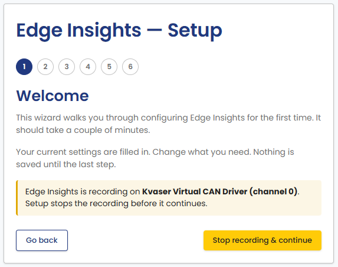
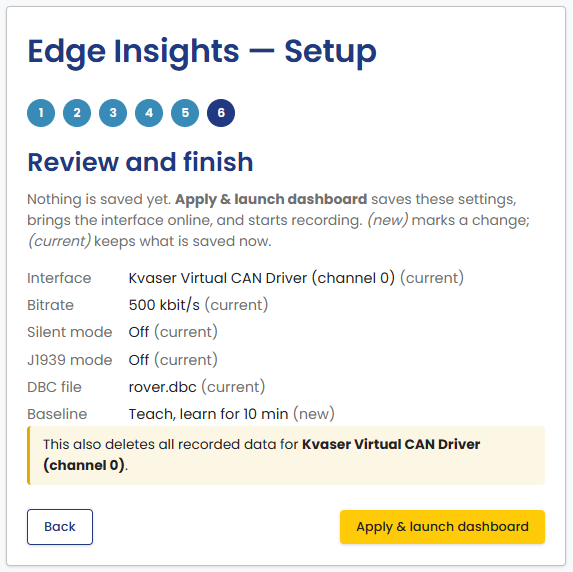

# First Run

Once Edge Insights is installed, open the portal:

- **Windows**: start "Edge Insights" from the Start menu or the desktop
  shortcut. The application starts the services and opens the portal.
- **Linux desktop**: start "Edge Insights" from the application menu.
  The application starts the services and opens the portal.
- **Embedded device**: open `http://<device-hostname-or-ip>:36300` in a
  browser on another machine on the same network.

## Initial setup

The portal opens a setup wizard the first time you launch Edge Insights.
You can run it again later from the **Re-run setup wizard** link on the
Home page. See [Running the wizard again](#running-the-wizard-again).

The wizard saves nothing until its last step. Until then, you can go
**Back** and change any step. The settings take effect when you finish
the last step.

1. **Welcome**: a short introduction.

    

2. **CAN source**: choose **Configure my setup** to select a real
   interface, or **Try with demo data** to explore Edge Insights with a
   bundled sample log instead of live hardware. Demo data skips steps 3
   to 5. Its last step loads the sample log and the matching DBC file.

    

3. **CAN interface**: pick the interface, its bitrate, and how frames are
   read. Turn on **J1939 Mode** for a J1939 bus. See
   [CAN Settings](../portal/can-settings.md) for details on each option.
   **Silent Mode** stays off for a channel that does not support it, for
   example a Kvaser virtual channel.

    This step can also clear what is already recorded for the interface you
    pick. Tick **Clear existing data for this interface first** to start
    from a clean state, for example on a device redeployed to a different
    bus. It is off by default. The data is deleted when you finish setup,
    not on this step. The DBC file and your settings are not removed.

    

4. **DBC file (optional)**: upload a DBC file so Edge Insights can decode
   raw CAN frames into named signals. **Current DBC File** shows the file
   in use, or "None configured". Choose a file under **Upload DBC** and
   click **Upload & continue**. Edge Insights checks that the file is a
   valid DBC file, but uses it only when you finish setup. If you return
   to this step, it shows the uploaded file name and its number of
   messages. Click **Skip** to continue without a DBC file. You can add or
   change the file later from the CAN Settings page.

    

5. **Baseline mode**: choose Teach mode to let Edge Insights learn normal
   bus behavior for a set duration (1 to 60 minutes) before flagging
   anomalies, or Direct mode to start anomaly detection immediately with
   no baseline.

    

6. **Review and finish**: check the settings before they are saved. The
   list shows the interface, bitrate, silent mode, J1939 mode, DBC file,
   and baseline. *(new)* marks a value that this run changes. *(current)*
   marks a value that stays as it is saved now. If you ticked **Clear
   existing data for this interface first**, a warning states that the
   recorded data for the interface is deleted.

    Click **Apply & launch dashboard**. Edge Insights saves all settings,
    brings the interface online, and starts recording and analysis. Then
    the portal opens the Home page. If no interface is configured, the
    button only saves the settings.

    If the interface cannot be brought online, the wizard stays on this
    step and shows an error. Fix the cause and click **Apply & launch
    dashboard** again, or click **Back** to change the settings.

    

If no CAN hardware is connected, use the **Try with demo data** option
above, or import a log later from [Import Log](../portal/import-log.md).

### Running the wizard again

Click **Re-run setup wizard** on the Home page to change the settings
later. The wizard starts from the saved settings. Change what you need.
As on the first run, nothing is saved until the last step.

If Edge Insights is recording when the wizard opens, the Welcome step
shows a warning. Setup stops the recording before it continues. The
warning has two buttons:

- **Stop recording & continue** stops the recording and continues to the
  next step.
- **Go back** returns to the Home page. Recording continues. This button
  is not shown before setup has been completed once.

On the CAN interface and DBC file steps, **Keep current** keeps the
saved settings of that step and continues. The button reads **Skip** when
nothing is configured for that step yet. On the CAN interface step,
**Keep current** also ignores **Clear existing data for this interface
first**.

**Apply & launch dashboard** on the last step starts recording again. If
you leave the wizard before the last step, nothing is saved. To resume
recording, bring the interface up from
[CAN Settings](../portal/can-settings.md#interface-and-bus-settings).

## Activate the license

1. Copy your license key from the
   [License keys](https://www.canedudev.com/my-account/api-keys/) page of your
   canedudev.com account. See
   [Getting Edge Insights](get-edge-insights.md) if you do not have a key
   yet.
2. On the portal Home page, enter the key in the **License** card and
   click **Activate**.

The machine that runs Edge Insights needs an internet connection to
activate. After activation, Edge Insights runs offline. See
[Licensing](../portal/index.md#licensing) for details on the License card.

## Next steps

The [Portal Guide](../portal/index.md) describes each part of the portal:
CAN settings, importing and exporting data, and the Grafana dashboards.
