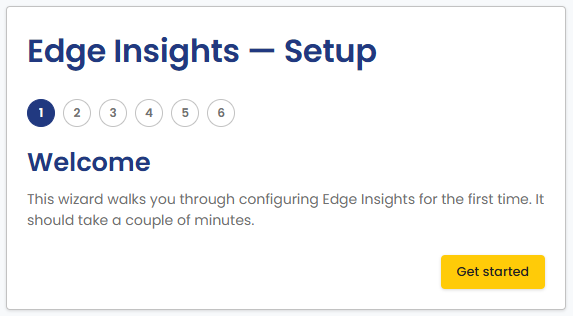
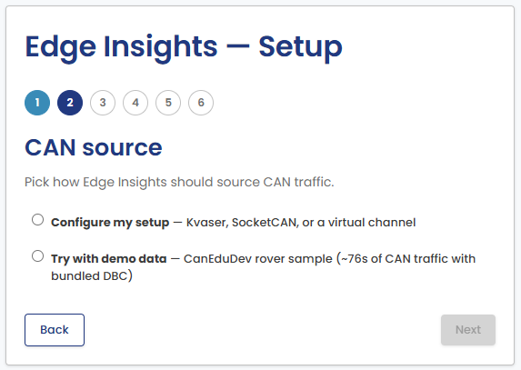
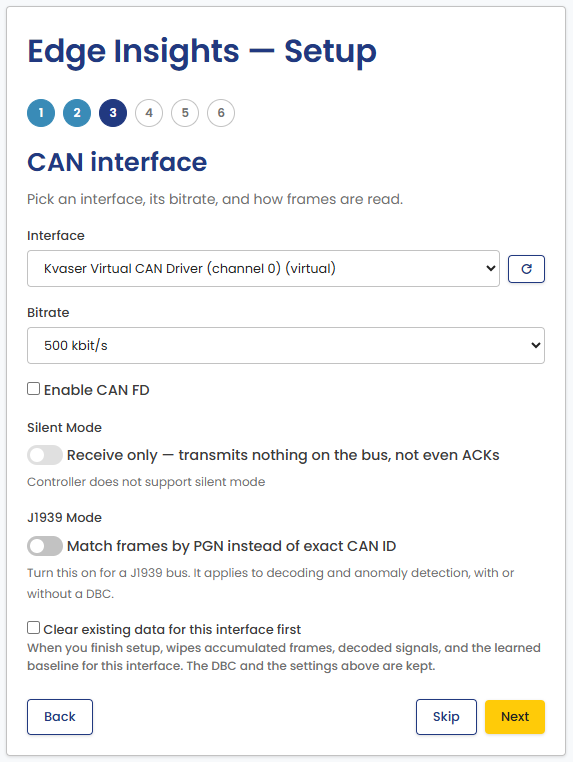
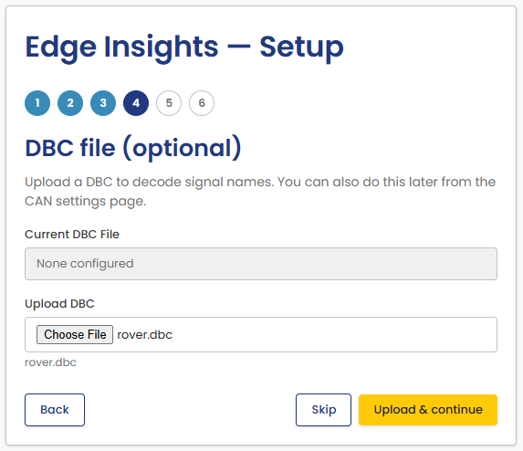
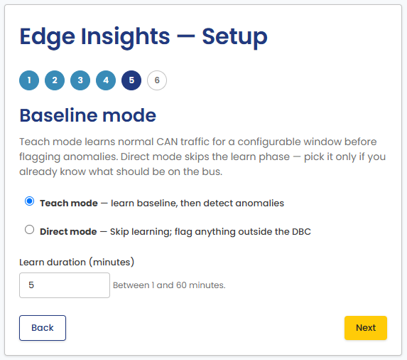
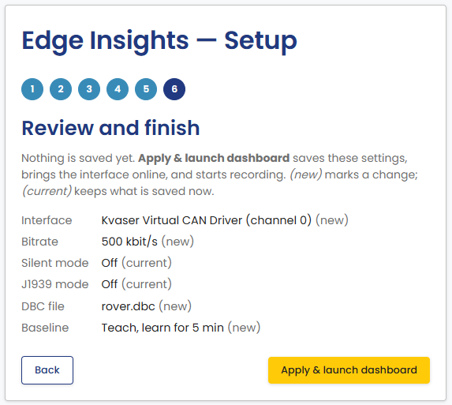

# First Run

Once Edge Insights is installed, open the portal:

- **Windows**: start "Edge Insights" from the Start menu or the desktop
  shortcut. The application starts the services and opens the portal.
- **Linux desktop**: start "Edge Insights" from the application menu.
  The application starts the services and opens the portal.
- **Embedded device**: open `http://<device-hostname-or-ip>:36300` in a
  browser on another machine on the same network.

## Initial setup

The portal opens a setup wizard the first time you launch Edge Insights.
You can re-run it later from the **Re-run setup wizard** link on the Home
page.

1. **Welcome**: a short introduction.

    

2. **CAN source**: choose **Configure my setup** to select a real
   interface, or **Try with demo data** to explore Edge Insights with a
   bundled sample log instead of live hardware. Demo data skips the next
   three steps.

    

3. **CAN interface**: pick the interface, its bitrate, and how frames are
   read. Turn on **J1939 Mode** for a J1939 bus. See
   [CAN Settings](../portal/can-settings.md) for details on each option.

    This step can also clear what is already recorded for the interface you
    pick. Tick **Clear existing data for this interface first** to start
    from a clean state, for example on a device redeployed to a different
    bus. It is off by default, and it asks for confirmation before erasing
    anything. The DBC file and your settings are not removed.

    

4. **DBC file (optional)**: upload a DBC file so Edge Insights can decode
   raw CAN frames into named signals. You can add or change this later
   from the CAN Settings page.

    

5. **Baseline mode**: choose Teach mode to let Edge Insights learn normal
   bus behavior for a set duration before flagging anomalies, or Direct
   mode to start anomaly detection immediately with no baseline.

    

6. **You're all set**: launch the dashboard to see live traffic, decoded
   signals, and detected anomalies.

    

If no CAN hardware is connected, use the **Try with demo data** option
above, or import a log later from [Import Log](../portal/import-log.md).

## Next steps

The [Portal Guide](../portal/index.md) describes each part of the portal:
CAN settings, importing and exporting data, and the Grafana dashboards.
