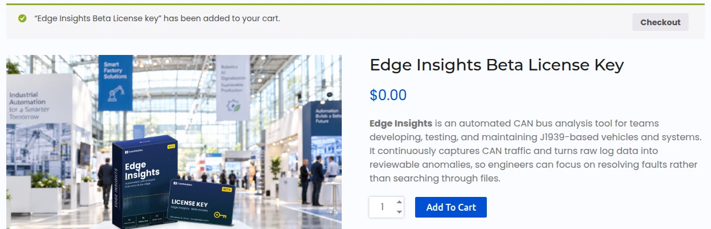
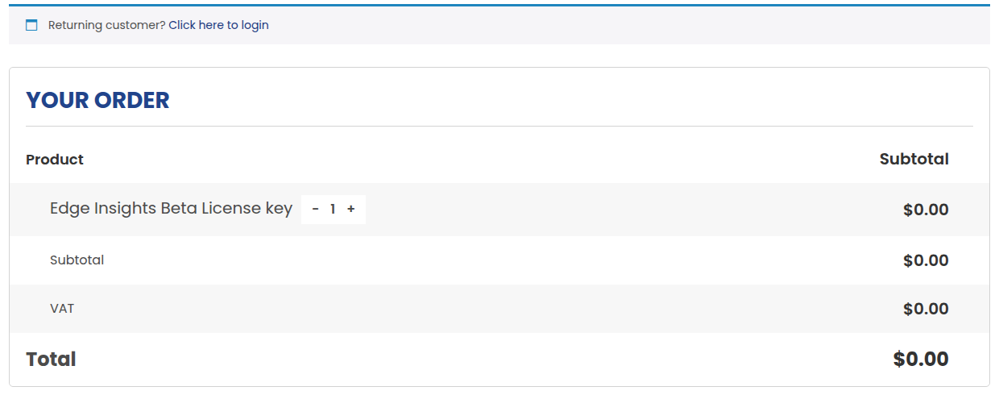
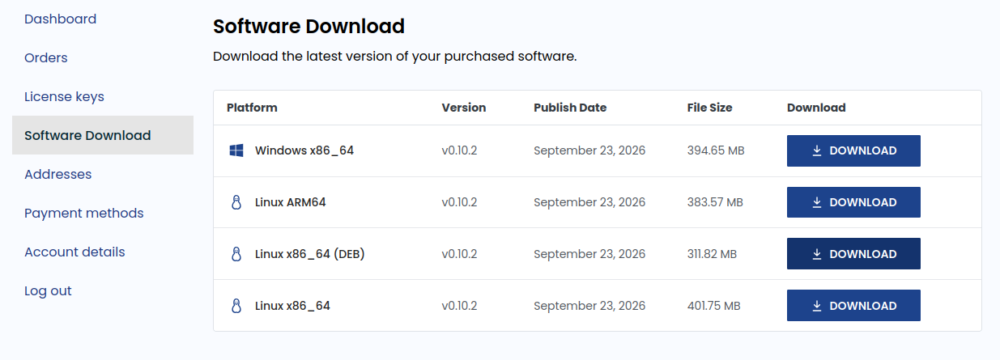
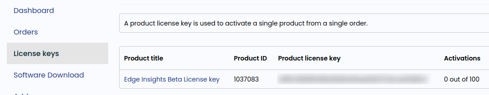

# Getting Edge Insights

You get Edge Insights from the CanEduDev store. During the beta, the
license is free.

Ordering the license creates an account on canedudev.com. The account
gives you the download links and your license key. You need the key to
activate Edge Insights after you install it.

## Order the beta license

1. Open the
   [Edge Insights Beta License key](https://www.canedudev.com/product/edge-insights-beta-license-key/)
   product page and click **Add to cart**. Then click **Checkout** in the
   message at the top of the page.

    

2. Check that the order total is $0.00. If you already have an account on
   canedudev.com, click **Click here to login** at the top of the page
   first.

    

3. Under **Billing details**, choose **Company** or **Private
   individual**, and fill in the required fields. Use an email address you
   can read. The store sends the download link to this address.

4. Click **Place order**.

The store creates an account for your email address and sends you an
email with the download link.

## Download the software

The download link in the email opens the Software Download page of your
account. You can also open it at any time: log in to canedudev.com and go
to
[Software Download](https://www.canedudev.com/my-account/software-downloads/).
During the beta, the page shows the latest version only.

Click **Download** on the row for your device, then continue with its
install page:

| Device | Row | Install page |
| --- | --- | --- |
| Windows PC | Windows x86_64 | [Installing on Windows](installation-windows.md) |
| Linux desktop PC | Linux x86_64 (DEB) | [Installing on a Linux desktop](installation-linux.md) |
| Embedded Linux device, arm64 | Linux ARM64 | [Installing on an embedded device](installation-embedded.md) |
| Embedded Linux device, x86_64 | Linux x86_64 | [Installing on an embedded device](installation-embedded.md) |

## Find your license key

Log in to canedudev.com and go to
[License keys](https://www.canedudev.com/my-account/api-keys/). Your Edge
Insights license key is listed under **Product license key**.
**Activations** shows how many devices use the key.

You enter the key in the portal after you install Edge Insights. See
[Activate the license](first-run.md#activate-the-license).

## Beta license terms

- The beta license is free.
- It is valid until the end of the beta, in January 2027.
- Each activation is tied to one device. One key can activate several
  devices, up to the limit shown under **Activations**.
- To free an activation, deactivate the key on that device. See
  [Licensing](../portal/index.md#licensing). You can also deactivate it on
  the [License keys](https://www.canedudev.com/my-account/api-keys/) page
  of your account, e.g. when you no longer have access to the device.

## Newer versions

Log in to
[Software Download](https://www.canedudev.com/my-account/software-downloads/)
and download the new version. Then install it as described on the install
page for your platform. An upgrade keeps your license activated.

## No email received

- Check your spam folder.
- Log in to canedudev.com. The download is on the
  [Software Download](https://www.canedudev.com/my-account/software-downloads/)
  page, and your license key is on the
  [License keys](https://www.canedudev.com/my-account/api-keys/) page. If you
  do not know your password, use **Lost your password?** on the login
  page.
- If you still cannot find them, email
  [support@canedudev.com](mailto:support@canedudev.com).
