# Installing on Windows

## Download

Download `edge-insights-<version>-windows-x86_64-setup.exe` from the
release.

## Security warnings

Windows can show separate warnings when you download the installer and
when you run it. Both are expected; click through them to continue.

### Microsoft Edge blocks the download

After the download finishes, Edge flags the installer because it "isn't commonly downloaded."

1. Click the three dots, then choose **Keep** from the menu.

    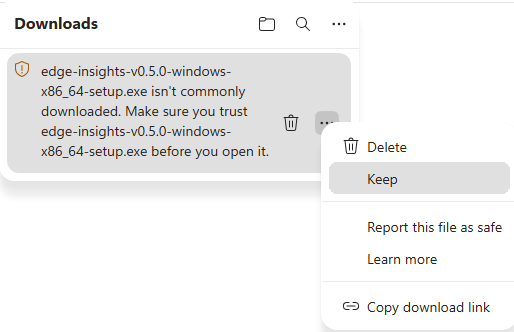

2. Click the **Delete** dropdown arrow, then choose **Keep anyway**.

    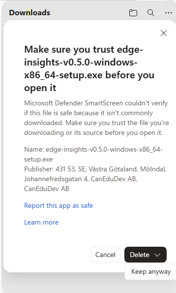

### Windows SmartScreen blocks the installer.

When you run the downloaded installer, Windows may separately show a blue
"Windows protected your PC" screen. This is a different, OS-level warning, not
the Edge one above.

1. Click **More info**.

    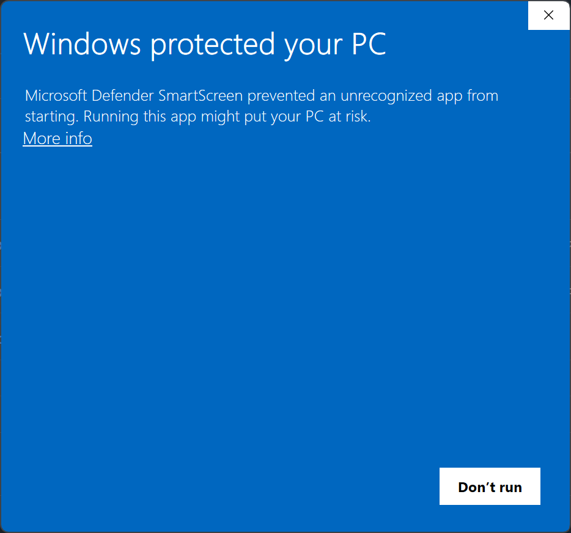{ width="500" }

2. Click **Run anyway**.

    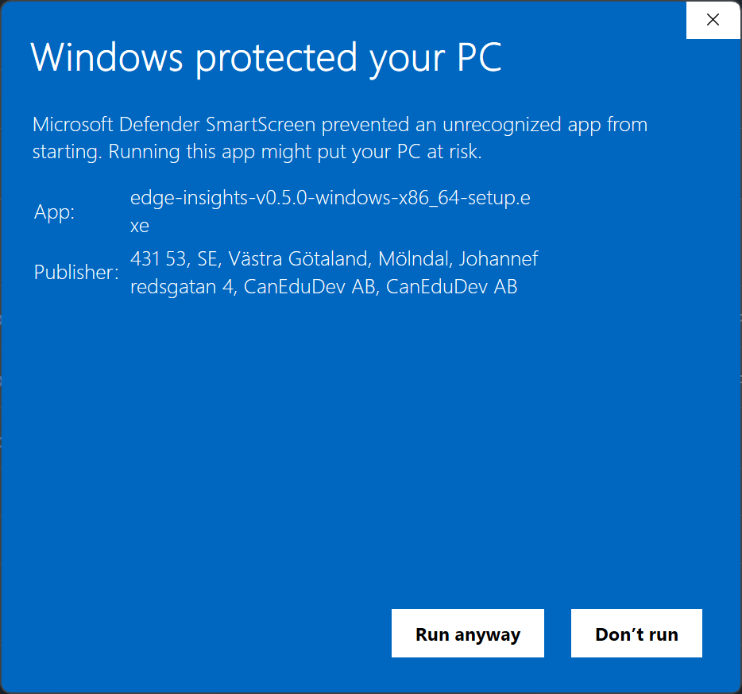{ width="500" }

## Install

Run the downloaded installer. It installs per-user, into
`%LOCALAPPDATA%\CanEduDev\EdgeInsights`. No administrator rights are
required for the Edge Insights installation itself.

1. Optionally check **Create a desktop shortcut**, then click **Next**.

    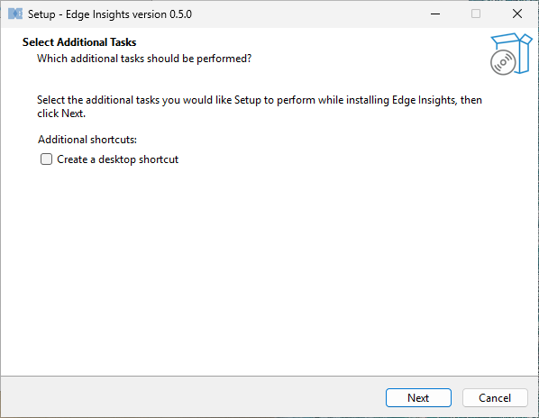

2. Click **Install** to begin.

    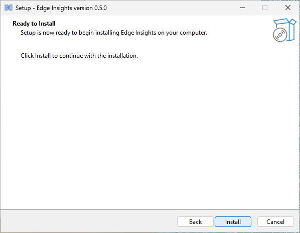

3. Setup extracts and installs the application files.

    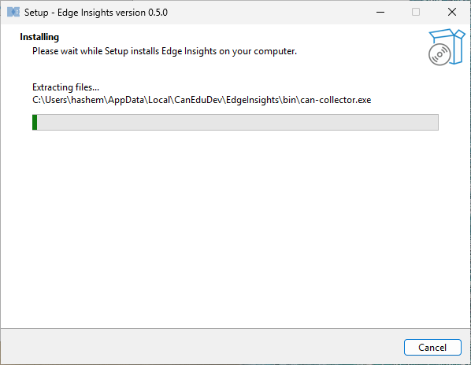

4. The installer checks for the Kvaser CAN driver and the Kvaser CANlib
   runtime, and installs them if missing. A Windows UAC prompt appears for each
   Kvaser installer it runs. Click **Yes** to continue.

    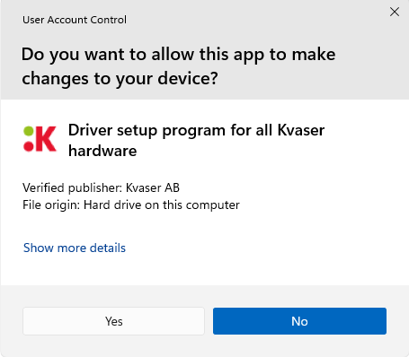

    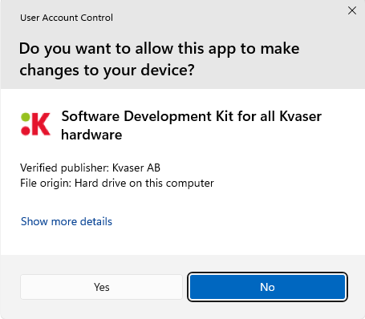

4. Setup finishes one of two ways, depending on whether the Kvaser driver
   was just installed:

    - **Driver installed**: a reboot is required before the CAN
      interface can be used. Choose to restart now or later.

        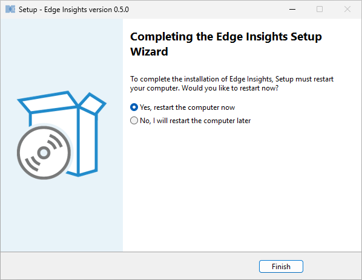

    - **Driver already present**: Setup finishes directly. Leave
      **Launch Edge Insights** checked to start it right away.

        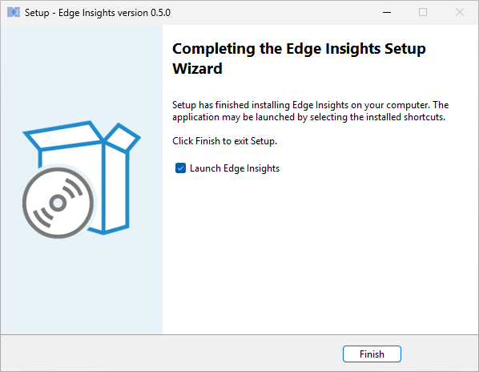

## Launch

Start Edge Insights from the Start menu, or the desktop shortcut if you
created one.

## Uninstall

Uninstall Edge Insights from **Settings → Apps → Apps & Features**, like
any other Windows application.

Setup asks a few questions before removing anything:

1. Whether to also remove your data.

    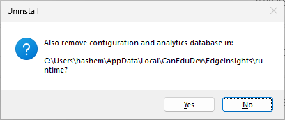

    - **Yes** deletes the configuration and analytics database in
      `%LOCALAPPDATA%\CanEduDev\EdgeInsights\runtime`, e.g. CAN settings,
      DBC files, imported logs, and analysis results.
    - **No** (the default) leaves this data in place, so it's still there
      if you reinstall later.

2. If Setup installed the Kvaser driver for you, whether to remove it too.
   Removing it may affect other Kvaser-based software on the same
   machine. Answering **Yes** brings up a separate Windows UAC prompt,
   since removing the driver needs administrator approval.

    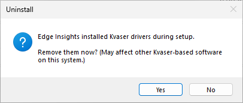

3. Same question for the Kvaser CANlib SDK, if Setup installed it. Also
   followed by a UAC prompt if you answer **Yes**.

    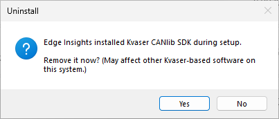

4. A final confirmation before removal starts.

    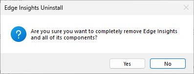
