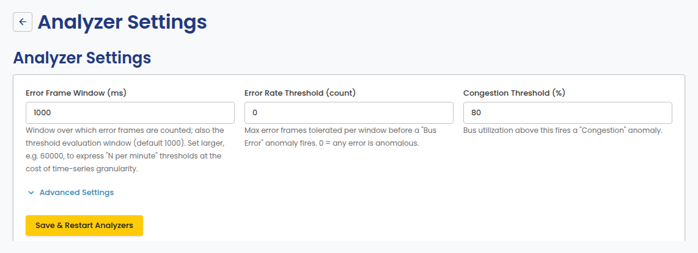
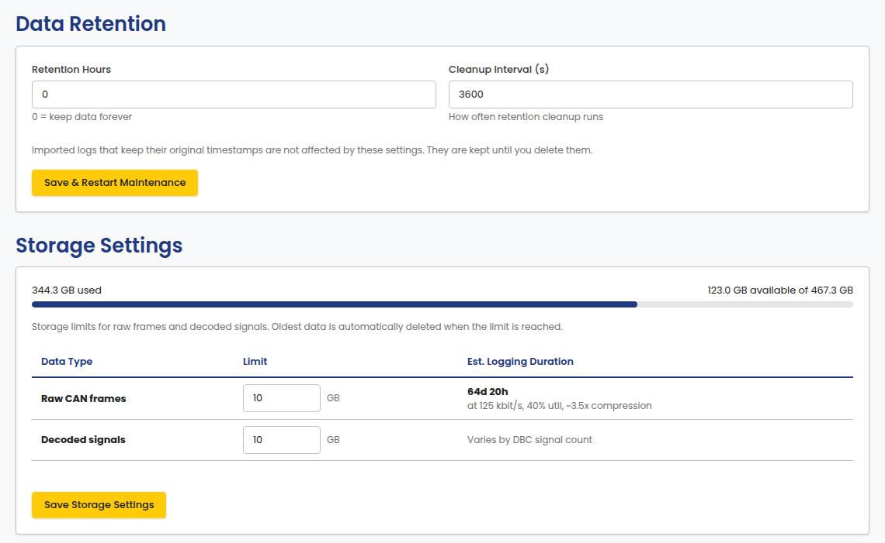

# Analyzer Settings

Configure anomaly-detection thresholds and data retention. Open it from
**Analyzer** in the portal sidebar, under Settings.

## Thresholds

- **Error Frame Window (ms)**: the window over which error frames are
  counted; also the threshold evaluation window.
- **Error Rate Threshold (count)**: the maximum error frames tolerated
  per window before a Bus Error anomaly fires. 0 means any error is
  anomalous.
- **Congestion Threshold (%)**: bus utilization above this fires a
  Congestion anomaly.

## Data Retention and Storage Settings

Set how long data is kept, and storage limits for raw frames and decoded
signals. Oldest data is automatically deleted when a limit is reached.

Imported logs that keep their original timestamps are not affected by the
retention setting. They are kept until you delete them.

