# CAN Settings

Configure the CAN interface Edge Insights captures from, manage the DBC
file used to decode signals, and control baseline learning.

## Interface and bus settings

Select the interface to use and its bus parameters. Edge Insights
captures from one interface at a time; if your hardware has multiple
channels, choose which one to use here. Bus settings are locked while the
interface is up. Bring it down first to change them.

/// note
SocketCAN virtual interfaces have no physical bus parameters to set, so the
settings are grayed out. The interface can still be brought up, and the
bitrate requirement below does not apply to it.
///

The capture control is at the bottom of the Bus Settings card:

- **Save & Bring Up** saves the settings above it and starts capture on
  the selected interface. It can take up to 10 seconds. The button stays
  disabled until a nominal bitrate is set. A device that joins a bus at the
  wrong bitrate disturbs the other devices on it, so Edge Insights never
  brings the bus up on a guessed rate.
- **Bring Down** replaces it while the interface is up. It stops capture.
  Data captured just before bring-down is still processed in the
  background, so dashboards may keep updating briefly.

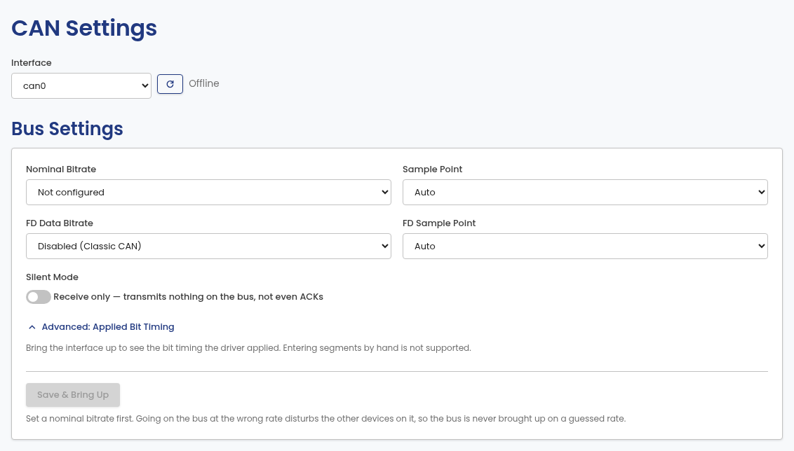

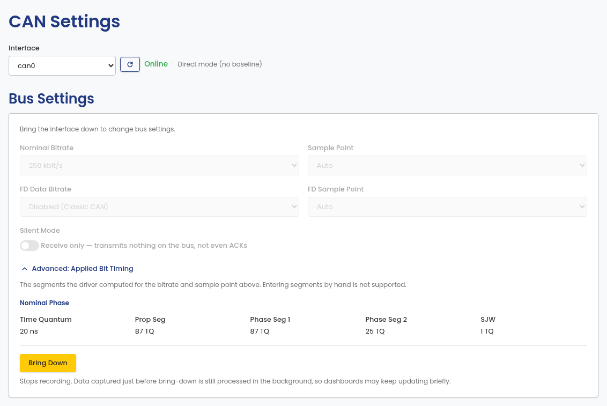

**Boot Autostart** brings the configured interface up automatically when
Edge Insights starts. When it is off, the interface stays down until you
bring it up yourself.

This option only appears on installs that are set up to start at boot,
which is a choice made when Edge Insights is installed. Elsewhere there is
nothing for it to schedule, so it is hidden: a desktop install runs while
the application is open, and a Windows install starts with the portal. See
[Starting at boot](../getting-started/installation-embedded.md#starting-at-boot).

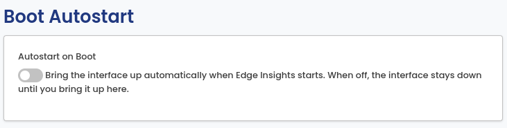

## Protocol

**J1939 Mode** matches frames by PGN (Parameter Group Number) instead of
exact CAN ID. Turn it on for a J1939 bus. NMEA2000 uses the same PGN
addressing, so turn it on for NMEA2000 buses too. Note that NMEA2000
signals sent as Fast Packet span several frames and are not decoded.

A J1939 frame carries the address of the sending device in the lowest byte
of the CAN ID, so the same message arrives with a different CAN ID from
every device that sends it. Matching by PGN ignores that address, so one
entry covers every sender of the message, including devices that appear on
the bus later.

The setting applies to the whole pipeline, not only to decoding. It
controls how DBC messages are matched, and how the Known PGNs list and the
learned baseline are keyed. A DBC file is not required. With no DBC
loaded, J1939 Mode still keys foreign-traffic detection by PGN.

Changing the mode takes effect immediately. Stored frames are decoded
again, which takes a few seconds.

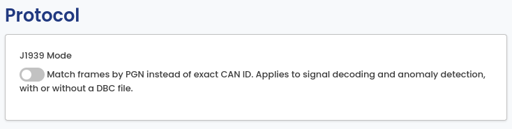

## DBC file

Upload a DBC file to decode raw CAN frames into named signals. Uploading a
new file replaces the current one.

For a J1939 database, turn on J1939 Mode under [Protocol](#protocol)
first. A J1939 database defines its messages per PGN, so with the mode off
it matches no frames at all and nothing is decoded.

Signals wider than 64 bits are skipped when the file loads. These describe
payloads that are reassembled from several frames, which Edge Insights
does not currently support. The rest of the file loads normally.

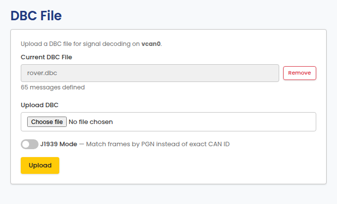

## Baseline

Baseline learning establishes what normal bus traffic looks like, so later
traffic can be compared against it. Set the learn duration (1–60 minutes)
and save; saving restarts the learn phase. **Restart baseline learning**
discards the current baseline and starts over.

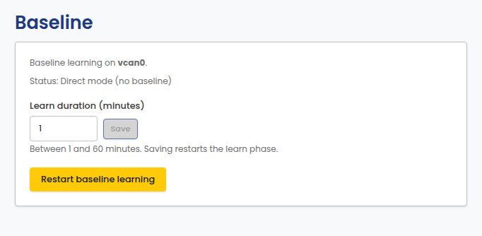

## Known CAN IDs / Known PGNs

CAN IDs not covered by the DBC file, the baseline allowlist, or this list
are flagged as foreign traffic. IDs from an uploaded DBC file are added
automatically. Add or remove entries manually here.

The card follows the mode set under [Protocol](#protocol):

| J1939 Mode | Card title | Entries are | Largest value |
| ---------- | -------------- | ------------- | ------------ |
| Off        | Known CAN IDs  | exact CAN IDs | `0x1FFFFFFF` |
| On         | Known PGNs     | PGNs          | `0x3FFFF`    |

Values outside the range for the active mode are rejected when you add
them. With J1939 Mode on, a parameter group is allowlisted once and covers
every device that sends it. With the mode off, each device needs its own
entry, because each one sends the message with a different CAN ID.

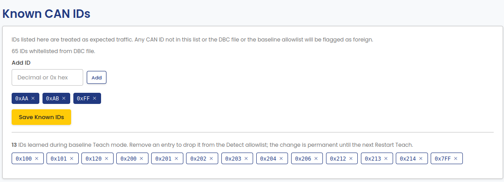

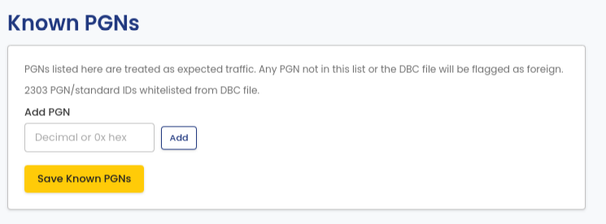

### Switching between the two

The same number means different things in the two modes, so entries cannot
be carried across. Switching J1939 Mode while the list is not empty asks
for confirmation first. The confirmation states how many configured and
learned entries are affected.

Confirming clears the configured entries and the learned baseline IDs,
then saves the new mode. Entries you add after the switch are kept.
Canceling leaves the mode and the list unchanged.

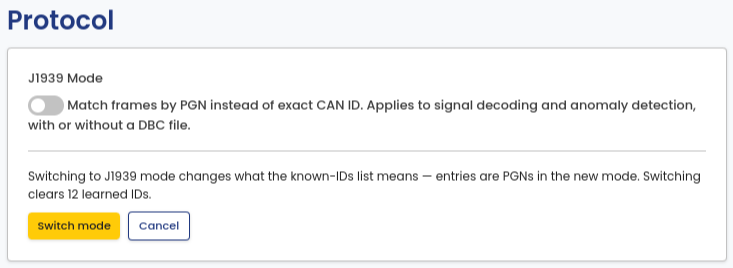

IDs learned into the baseline are listed separately below the configured
list. Removing one drops it from the Detect-phase allowlist, and the
change is permanent until baseline learning is restarted (see
[Baseline](#baseline)).

## Danger Zone

Clear all recorded data for an interface: raw frames, decoded signals,
and analysis results. This is not part of the normal import flow;
nothing runs unless you start it, and the action cannot be undone.

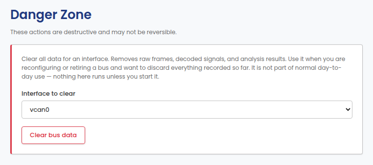

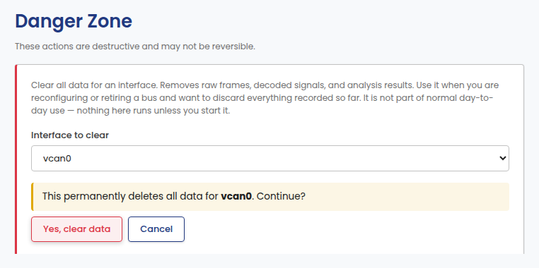
