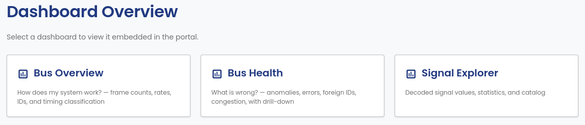
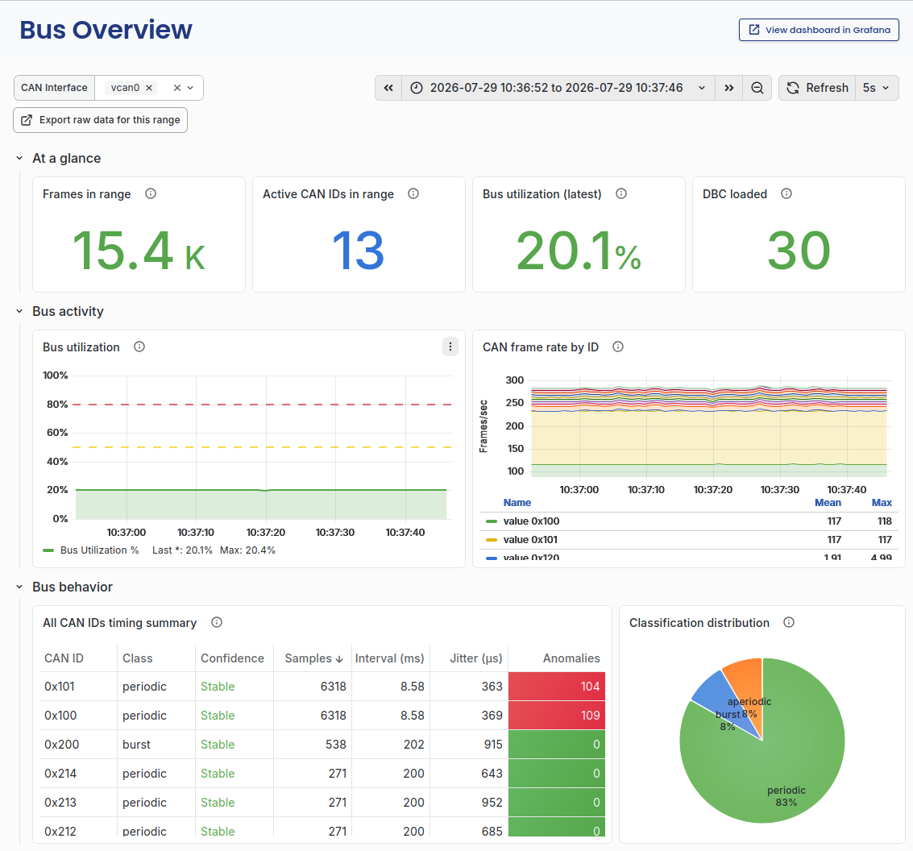
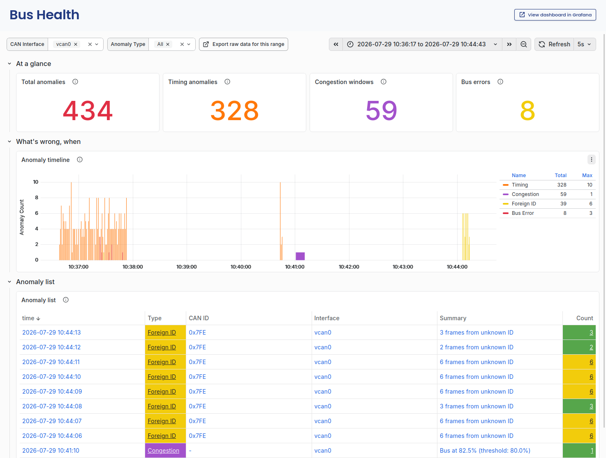
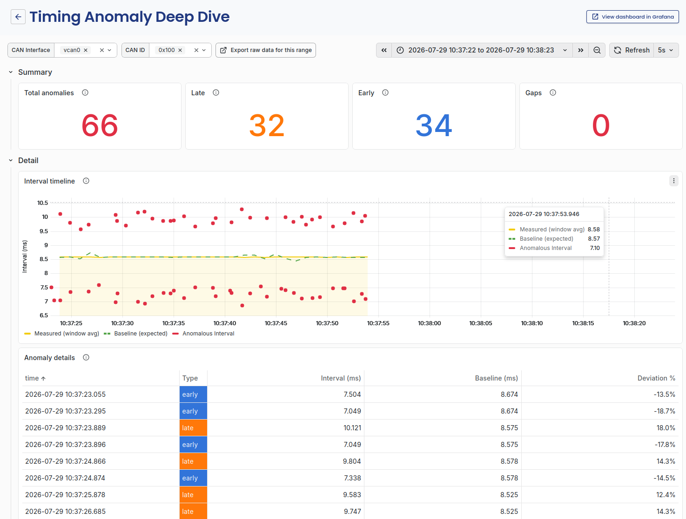
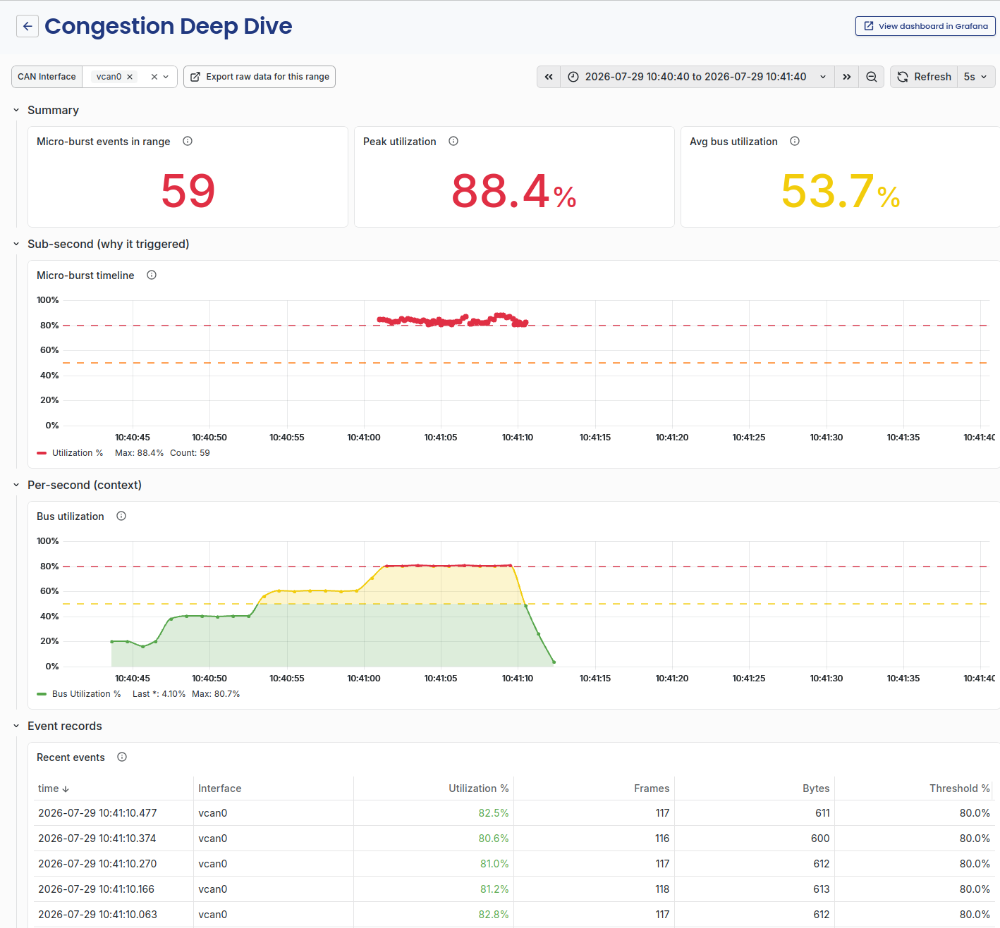
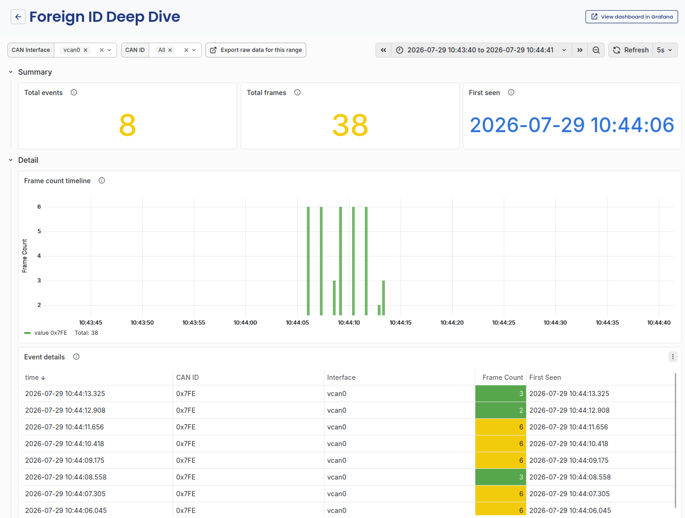
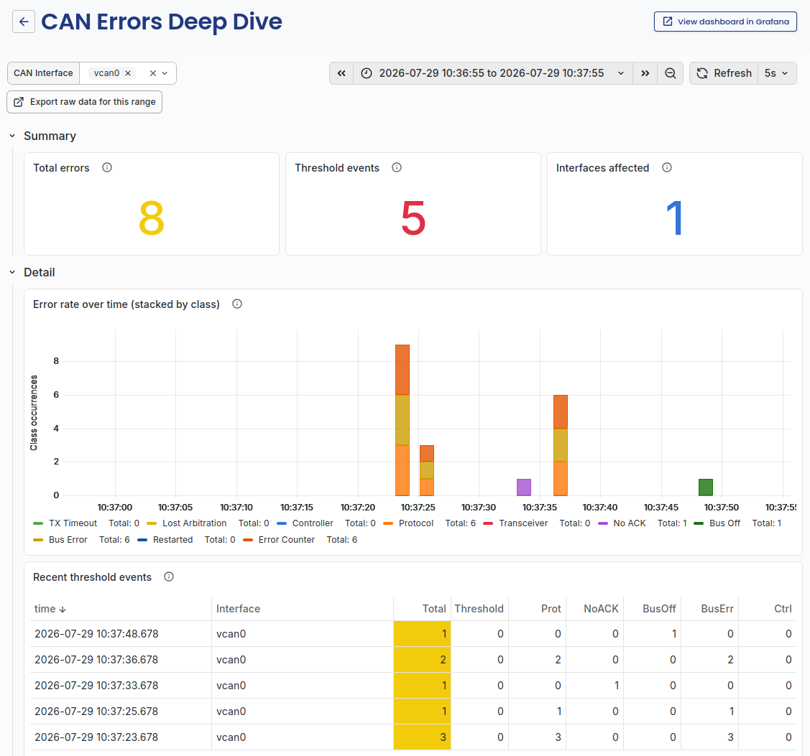
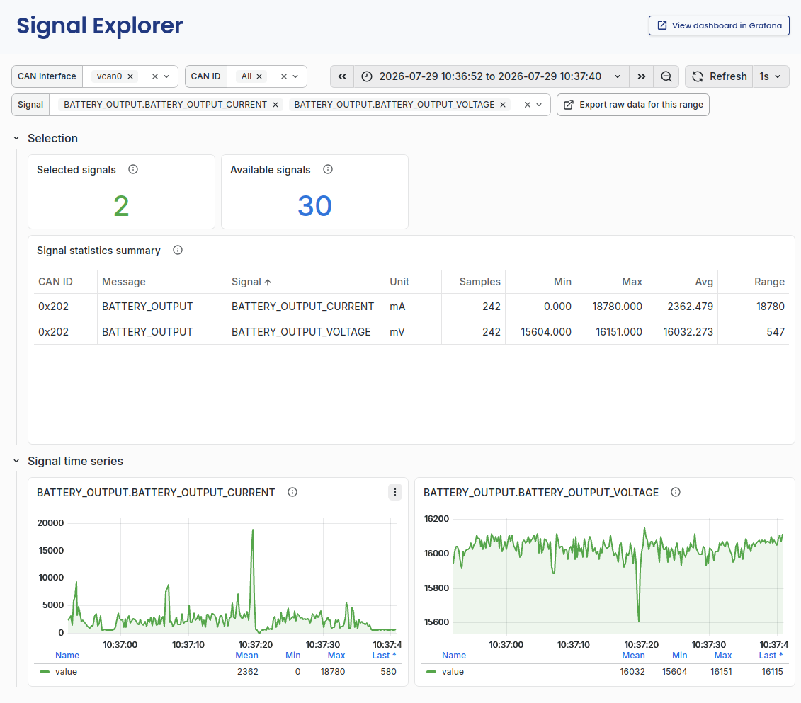

# Dashboards

Edge Insights embeds three Grafana dashboards in the portal. Open them
from **Dashboards** in the sidebar.

- **Bus Overview**: how does my system work? Frame counts, rates, CAN
  IDs, and timing classification.
- **Bus Health**: what is wrong? Anomalies, errors, foreign IDs, and
  congestion, with drill-down.
- **Signal Explorer**: decoded signal values, statistics, and a signal
  catalog. Needs a DBC file loaded on the interface, see
  [CAN Settings](can-settings.md#dbc-file).

Each dashboard opens embedded in the portal, with a link to open it
directly in Grafana. The time-range picker and refresh interval at the top
apply within the embed, same as in Grafana itself. Every panel has a
**(?)** icon next to its title. Hover over it for a description of what
the panel shows.

## Bus Overview

- **At a glance**: frames in range, active CAN IDs in range, latest bus
  utilization, and how many DBC messages are loaded.
- **Bus activity**: bus utilization over time, and CAN frame rate broken
  down by ID.
- **Bus behavior**: a timing summary per CAN ID, covering classification,
  confidence, sample count, and average interval, plus the overall
  classification distribution across periodic, aperiodic, and burst
  categories.

## Bus Health

- **At a glance**: total anomalies, timing anomalies, congestion windows,
  and bus errors in range.
- **What's wrong, when**: an anomaly timeline, split by type: timing,
  congestion, foreign ID, bus error.
- **Anomaly list**: every anomaly in range, with timestamp, type, CAN ID,
  interface, a summary, and a count. Filter by CAN interface or anomaly
  type using the controls at the top.

## Anomaly drill-down

Click a row in the **Anomaly list** on Bus Health to open a deep-dive
dashboard for that anomaly. Which dashboard opens depends on the type in
the row.

| Type | Opens | Filtered to |
| ---- | ----- | ----------- |
| Timing | Timing Anomaly Deep Dive | The CAN ID in the row |
| Congestion | Congestion Deep Dive | The interface |
| Foreign ID | Foreign ID Deep Dive | The interface |
| Bus Error | CAN Errors Deep Dive | The interface |

Only a timing anomaly belongs to a single CAN ID. The other three
describe the state of the bus, so they open filtered to the interface.
Every deep dive opens on a time range around the event, with about 30
seconds of context on each side. Change it with the time picker.

### Timing

The **Interval timeline** panel plots two lines.

- **Measured (window avg)**: the average time between frames for that CAN
  ID, over one aggregation window.
- **Baseline (expected)**: the reference cadence the analyzer scores
  against. Edge Insights learns this value from the bus. It is not the
  cycle time declared in the DBC file.

Anomalies are scored against the baseline, not against the measured
average. Red points mark the individual intervals that fell outside the
threshold.

The two lines answer different questions. If they sit on top of each
other, the message is running at its normal cadence. If the measured line
drifts away from the baseline while few frames are flagged, the cadence
has shifted but each frame is still inside the allowed band. This is an
early sign of a timing problem. If the measured line stays on the
baseline while red points appear, the average cadence is normal and
individual frames are jittering.

The **Anomaly details** table lists every flagged frame with its measured
interval, the baseline it was scored against, and the deviation between
them.

### Congestion

A microburst is a short window, well under a second, where bus
utilization crossed the congestion threshold. Set the threshold in
[Analyzer Settings](analyzer-settings.md#thresholds).

The dashboard shows the same traffic at two time scales, and the
difference between them is the point.

- **Sub-second (why it triggered)**: the **Micro-burst timeline** plots
  one point per event, at the utilization measured during that short
  window. These are individual events, not a continuous signal.
- **Per-second (context)**: the **Bus utilization** panel plots the
  per-second average over the same range.

A burst that saturates the bus for 200 ms stands out in the first panel
and is almost invisible in the second, because the per-second average
spreads it over five times its duration. Read the two together to tell an
isolated burst from sustained pressure. The **Avg bus utilization** and
**Peak utilization** numbers at the top make the same comparison in a
single figure each.

The **Recent events** table lists every microburst with its utilization,
frame count, payload bytes, and the threshold that applied at the time.
The threshold is recorded per event, so events from before a settings
change still show the value they were judged against.

### Foreign ID

A foreign ID is a CAN ID that is not defined in the loaded DBC file, not
learned during baseline Teach mode, and not listed under
[Known CAN IDs](can-settings.md#known-can-ids). It can mean a new or
misconfigured ECU, a device left connected from an earlier test, or
traffic that does not belong on the bus.

The **Frame count timeline** plots one series per foreign ID, so a
steady talker and a one-time appearance look different at a glance. The
**Event details** table lists every event with its frame count and the
timestamp the ID was first seen.

The drill-down opens with every foreign ID on the interface selected.
Narrow it with the **CAN ID** filter at the top when one ID is of
interest.

Before treating a foreign ID as a fault, check that it is not simply
missing from your configuration. Adding it under Known CAN IDs stops the
anomalies.

### Bus error

These are errors reported by the CAN controller itself, not anomalies
derived from traffic patterns. A Bus Error anomaly fires when the number
of error frames in a window exceeds the error rate threshold, both set in
[Analyzer Settings](analyzer-settings.md#thresholds).

**Error rate over time** breaks the errors down by class: TX timeout,
lost arbitration, controller, protocol, transceiver, no ACK, bus off, bus
error, restarted, and error counter. The class points at the layer to
investigate. No ACK usually means nobody is listening, for example a
single node on the bus or a wiring fault. Lost arbitration is normal in
small numbers on a busy bus. Bus off means the controller took itself
off the bus after too many errors.

Two details when reading the stacked chart. A single error frame that
carries several class bits is counted once in the totals but appears in
each matching series, so the stacked total can be higher than the raw
frame count. Bus off and restarted are state transitions rather than
running counters, so they appear as isolated marks rather than a rate.

The **Recent threshold events** table lists the windows that crossed the
threshold, each with its own class breakdown.

## Signal Explorer

- **Selection**: how many signals are selected versus available, and a
  summary table with one row per selected signal: CAN ID, message, signal,
  unit, sample count, min, max, average, and range over the selected time
  range. Pick signals from the **Signal** filter at the top.
- **Signal time series**: a plot per selected signal.

