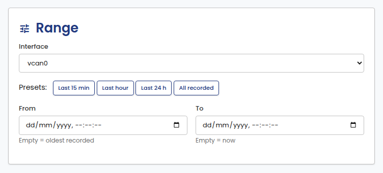
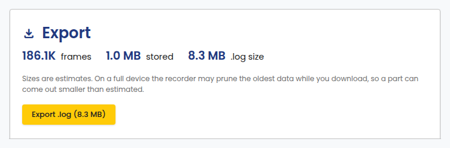
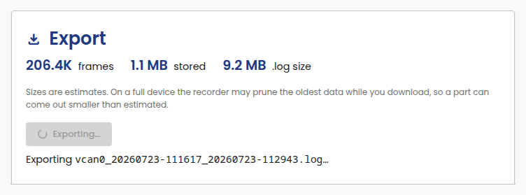
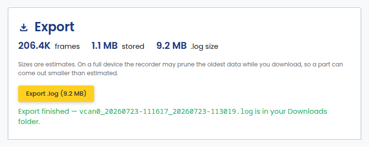
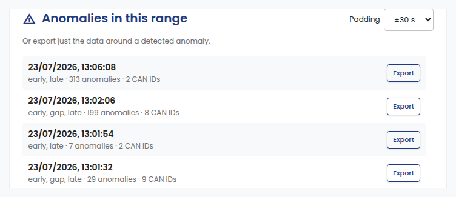

# Export Log

Export recorded raw CAN data as a candump `.log` file. Open it from
**Export Log** in the portal sidebar.

## Range

Pick an interface and a time range, either with a preset or explicit From/To
timestamps. Leave From empty to start at the oldest recorded frame, and To
empty for now.

## Export

The estimate updates as you adjust the range: frame count, stored size,
and resulting `.log` size. Sizes are estimates. If storage limits are
active, the oldest data may be pruned while the download runs, so the file
can come out smaller than estimated.

Click **Export .log** to start. The button shows progress while the file
is prepared:

When it finishes, the downloaded file name appears below the button:

## Anomalies in this range

Detected anomalies in the selected range are listed below the export
controls, each with its own **Export** button. Use this to export just the
data around a specific anomaly instead of the whole range. The padding
before and after the anomaly is configurable.

## Export from a dashboard

Each [Dashboard](dashboards.md) has its own **Export raw data for this
range** link in its toolbar. Clicking it opens Export Log with the
interface and time range already set to match what the dashboard was
showing, so you can jump straight to exporting a range you spotted on a
chart.

<video controls loop playsinline>
  <source src="../../images/portal/export-log/export-range-from-dashboard.mp4" type="video/mp4">
</video>
