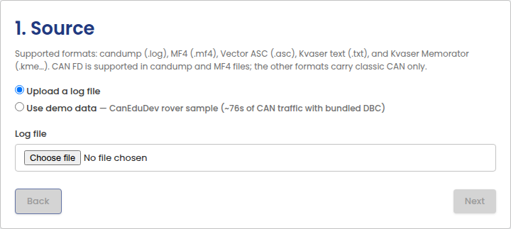
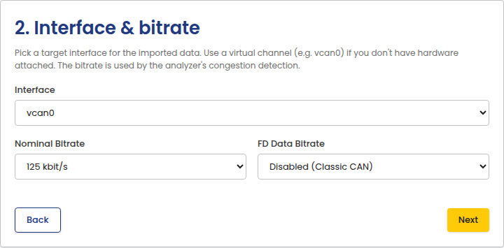
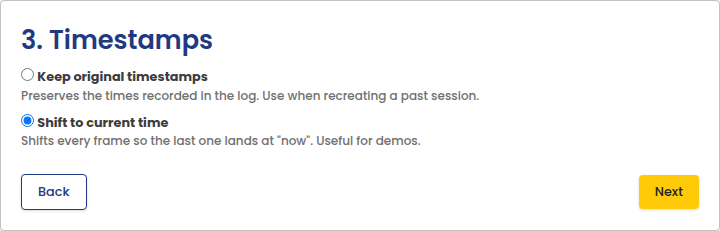
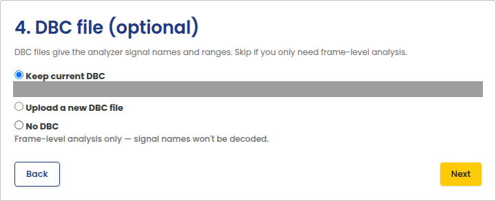
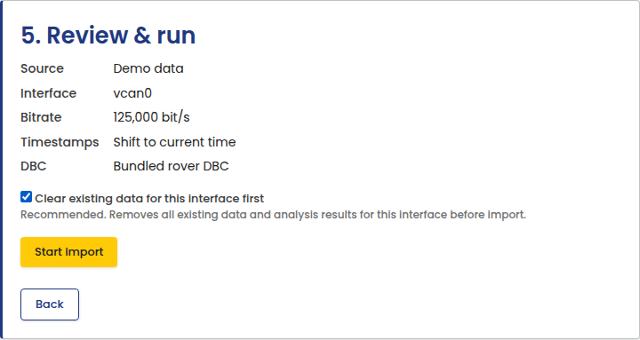
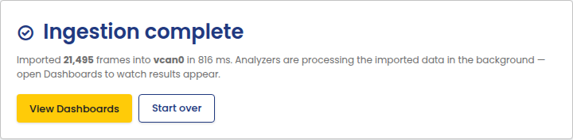

# Import Log

Import a CAN log file for offline analysis, or load the bundled demo data
to explore Edge Insights without live hardware. Open it from **Import
Log** in the portal sidebar.

## 1. Source

Choose a log file to upload, or use the bundled demo data, a short
CanEduDev Rover sample with its own DBC file. Supported formats: candump
(`.log`), MF4 (`.mf4`), Vector ASC (`.asc`), Kvaser text (`.txt`), and
Kvaser Memorator (`.kme…`). CAN FD is only supported in candump and MF4
files; the other formats carry classic CAN only.

## 2. Interface & bitrate

Choose the interface to import into and its bitrate.

## 3. Timestamps

Keep the original recorded timestamps to recreate a past session, or shift
every frame so the last one lands at "now". Useful for demos.

## 4. DBC file (optional)

Keep the interface's current DBC file, upload a new one, or import with no
DBC. Demo data always uses its bundled DBC.

## 5. Review & run

Review the summary and start the import. Clearing existing data for the
interface first is recommended so results aren't mixed with a previous
import.

Once the import finishes, open the dashboards to see the results.

