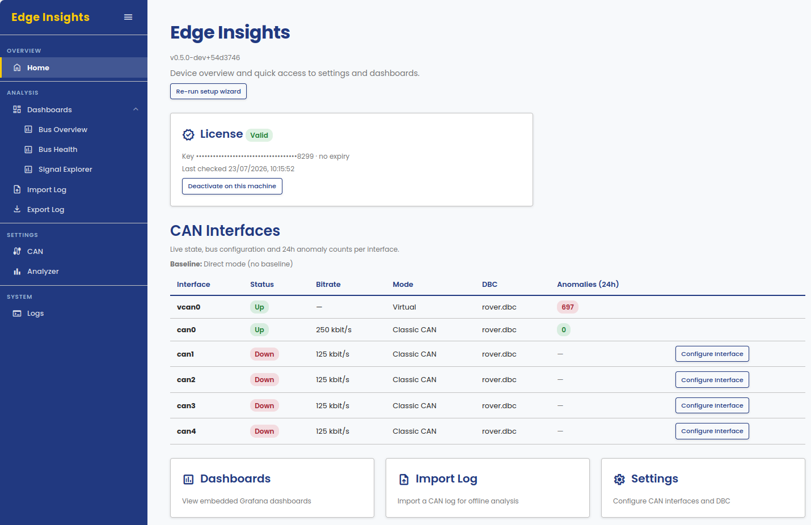
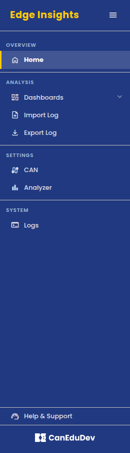
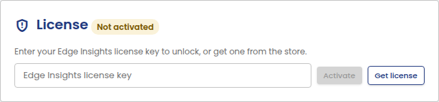
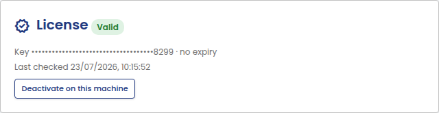
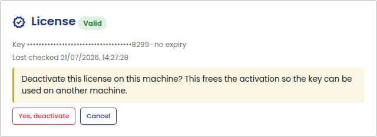

# Portal Guide

The Edge Insights portal is the local web UI you use to configure capture,
manage DBC files, import and export data, and view Grafana dashboards.

On a desktop PC (Windows or Linux), Edge Insights runs through a launcher:
it starts the analytics services and opens the portal in its own window,
then stops the services again when you close that window. You can also
open the same portal in a regular browser instead, at
`http://localhost:36300`, if you prefer. On an embedded or headless
device there is no launcher: the services run continuously in the
background, and a browser is the only way to reach the portal, from
another machine on the network.

## Home page

The Home page is the starting point. It shows:

- **Re-run setup wizard**: replays the
  [initial setup wizard](../getting-started/first-run.md#initial-setup)
  at any time, to reconfigure the CAN interface, DBC file, or baseline
  mode from scratch.
- **License**: activation status for this installation.
- **CAN Interfaces**: live status, bus configuration, and a 24-hour
  anomaly count for each interface.
- Quick links to Dashboards, Import Log, and Settings.

## Navigation

The sidebar groups the rest of the portal:

- **Analysis**: [Dashboards](dashboards.md), [Import Log](import-log.md), and [Export Log](export-log.md).
- **Settings**: [CAN Settings](can-settings.md) and [Analyzer Settings](analyzer-settings.md).
- **System**: Logs.

The **[Help & Support](support.md)** button at the bottom of the sidebar
opens the support flow from any page.

## Licensing

The License card on the Home page shows whether Edge Insights is
activated on this installation.

To activate, enter your license key and click **Activate**:

Once activated, the card shows a masked key, expiry (if any), and when the
license was last checked:

To move a license to a different machine, deactivate it here first:

Confirming frees the activation so the same key can be used on another
machine.

You can also deactivate a license without access to the machine it's
activated on, by logging into your account at
[canedudev.com](https://canedudev.com).
