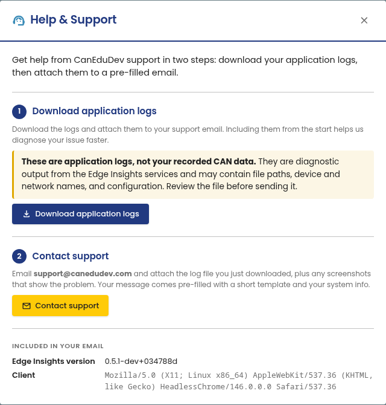

# Help & Support

Contact CanEduDev support from inside the portal. Open it from **Help &
Support** at the bottom of the portal sidebar, then follow the two steps:
download your application logs, then attach them to the pre-filled email.

The logs are diagnostic output from the Edge Insights services, not your
recorded CAN data. They may contain file paths, device and network names,
and configuration. Review the file before you send it.
